Liver Metastases survival analysis
================
Elisha Goldstein
11/6/2019

This project is an analysis on genuine clinical data set which was
formed after 5 years of treating patients in Bonn Uni-Klinikum. The data
set includes 158 patient with Liver Metastases but the original primary
tumor but is different.

The data set contains clinical and laboratory data:

The clinical data contains the following variables: Gender, Age, Primary
Tumor (1- Hepatocellular Carcinoma, 2 - Colorectal Carcinoma, 3 - Breast
Carcinoma, NA - Other), Therapy type (1 - SIRT, 2 - TACE)

Survival: The time (in month) from start of treatment in the clinic
until ‘event’ occurs or a case of death. Event: In survival analysis an
event refers to censoring of an observation from the research (f.e can’t
continue with treatment or decided to stop the process) and is labeled
as ‘0’. In case of death the label is ‘1’.

The laboratory data contains the variables: MMP9 (Metaloproteinase 9),
MMP2 (Metaloproteinase 2), Calgranulin A, Catalase, Profilin, RhoA, SOD2
(superoxide-dismutase), Trx (thioredoxin).

Additionally 4 type of Commet Assays have been measured. CA measures
fragmentation of the DNA, I - undamaged DNA, IV- damaged DNA:

I\_normalized - Commet Assay type I II\_normalized - Commet Assay type
II III\_normalized - Commet Assay type III IV\_normalized - Commet Assay
type IV

Lets start with loading the data and, choosing the relevant columns and
reorder them.

``` r
Liver_rawdata<-read_excel("Final table_big data project_Radiology Bonn.xlsx")
Liver_data<-Liver_rawdata[,c(5,9,12,14:16,26,31,40,42:43,67,73,79,85,91,97)]
Liver_data<-Liver_data[,c(1:3,6:17,4:5)]
```

Lets have a look on the data set

``` r
str(Liver_data)
```

    ## tibble [158 x 17] (S3: tbl_df/tbl/data.frame)
    ##  $ Gender        : chr [1:158] "F" "F" "F" "M" ...
    ##  $ Primary_Tumor : num [1:158] 3 NA 2 2 1 NA 2 1 NA 2 ...
    ##  $ Therapy       : num [1:158] 1 1 1 1 2 1 1 1 1 1 ...
    ##  $ Age           : num [1:158] 55 52 46 67 79 61 76 46 51 64 ...
    ##  $ MMP_9         : num [1:158] 2 1.5 1 1 5 1 2 2 1 1 ...
    ##  $ MMP_2         : num [1:158] 1 1 3.5 2 3 1 2 2 2 2 ...
    ##  $ I_normalized  : chr [1:158] "0.84440839999999995" "0.79237500000000005" "0.87906280000000003" "0.83554689999999998" ...
    ##  $ III_normalized: chr [1:158] "5.0243111999999999E-2" "5.4163031E-2" "2.7365084000000001E-2" "4.7537764000000003E-2" ...
    ##  $ IV_normalized : chr [1:158] "3.1880064999999999E-2" "6.6199259999999996E-2" "4.0732536E-2" "2.1816395999999998E-2" ...
    ##  $ Calgranulin   : num [1:158] 1.1514 1.7336 0.0646 0 0.7437 ...
    ##  $ Catalase      : num [1:158] 1.237 1.122 1.654 0.374 0.922 ...
    ##  $ Profilin      : num [1:158] 0.0387 0.0653 0.4692 0.0508 0.5526 ...
    ##  $ RhoA          : num [1:158] 1.874 1.627 1.156 0 0.769 ...
    ##  $ SOD2          : num [1:158] 0.1462 0.1792 0.2052 0.1642 0.0896 ...
    ##  $ Trx           : num [1:158] 0.1857 0.1414 0.1131 0.0397 0.2215 ...
    ##  $ Survival      : num [1:158] 3 2 4 3 14 21 18 30 5 23 ...
    ##  $ event         : num [1:158] 1 1 1 1 1 1 1 1 1 1 ...

The first 4 variables contains the clinical data. In the middle we have
all the biomarkers which are numerical, and at the end we have the
survival time and event.

</div>

#### PREPROCESSING

Here we deal with 0 values, missing values, and refactorting variables
to more convenient use

``` r
# Replace NA with 0 function. We use it  for categorical variables. For the biomarkesrs we will use another approach to deal with missing values.
na.zero <- function (x) {
  x[is.na(x)] <- 0
  x
}
Liver_data[,2:3]<-lapply(Liver_data[,2:3],na.zero)
# Refactor Gender to '0' (Female) and '1' (Male)
Liver_data$Gender<-factor(Liver_data$Gender,levels = c("F","M"),labels = c("0","1"))
# Decrease Therapy to '0' and '1' factors instead of '1' and '2' 
Liver_data$Therapy<-as.factor(Liver_data$Therapy-1)
Liver_data$Primary_Tumor <-as.factor(Liver_data$Primary_Tumor)
# Convert columns to numeric (instead of char)
cols_num<-c(7:9)
Liver_data[cols_num] <- sapply(Liver_data[cols_num],as.numeric)
#convert all the data to Data Frame
Liver_data<-as.data.frame(Liver_data)
```

Lets have again a look on the data:

``` r
head(Liver_data)
```

    ##   Gender Primary_Tumor Therapy Age MMP_9 MMP_2 I_normalized III_normalized
    ## 1      0             3       0  55   2.0   1.0    0.8444084     0.05024311
    ## 2      0             0       0  52   1.5   1.0    0.7923750     0.05416303
    ## 3      0             2       0  46   1.0   3.5    0.8790628     0.02736508
    ## 4      1             2       0  67   1.0   2.0    0.8355469     0.04753776
    ## 5      0             1       1  79   5.0   3.0    0.8961627     0.04701181
    ## 6      0             0       0  61   1.0   1.0    0.8716300     0.01253873
    ##   IV_normalized Calgranulin  Catalase   Profilin      RhoA       SOD2
    ## 1    0.03188006  1.15136226 1.2371134 0.03869407 1.8738574 0.14622642
    ## 2    0.06619926  1.73360242 1.1216495 0.06529625 1.6269488 0.17924528
    ## 3    0.04073254  0.06458123 1.6536082 0.46916566 1.1559020 0.20518868
    ## 4    0.02181640  0.00000000 0.3740219 0.05079007 0.0000000 0.16424116
    ## 5    0.02547453  0.74369324 0.9216495 0.55259976 0.7694878 0.08962264
    ## 6    0.03185359  0.00000000 0.6978799 0.85880980 1.0968820 0.96705882
    ##          Trx Survival event
    ## 1 0.18567389        3     1
    ## 2 0.14137606        2     1
    ## 3 0.11310085        4     1
    ## 4 0.03972868        3     1
    ## 5 0.22148916       14     1
    ## 6 0.23205342       21     1

Good, the data set is much more convenient now.

Next we check for missing values:

``` r
sum(is.na(Liver_data))
```

    ## [1] 295

There are a lot of NA’s in the data set. Because we want to stratify the
patients according to as much biomarkers as possible, we will choose
only the patients which have all the information, and drop patients with
missing values:

``` r
Liver_data<- na.omit(Liver_data)
dim(Liver_data)
```

    ## [1] 108  17

We are left with 108 observation, the data decreased in about a third.
But it is necessary.

</div>

#### Uni-Variate Analysis - Kaplan Meier Plots

In Survival Analysis, it is common to use Kaplan Meiers (KM) plots for
visualization. The KM shows only one variable at a time, and only for a
categorical variable, that’s why we will divide the values of the
biomarkers in the median and label them as “High” for above median, and
“low” for beneath. This rough division is not precise if we are
interested in personalized approach, but it is good to get an idea about
the influence of each biomarker on survival,

``` r
par(mfrow=c(1,5)) #reset settings to see all the plots at once
#loop over all the biomarkers
for (i in colnames(Liver_data[5:15])){
  BioM_median<-median(Liver_data[[i]]) #find median of the biomarker
  Liver_data$BioMarker_High_Low<-factor(ifelse(Liver_data[[i]] > BioM_median ,"High","Low")) # add labels
  surv_object<-Surv(time = Liver_data$Survival, event = Liver_data$event) # create survive object fot the KM 
  fit1 <- survfit(surv_object ~ BioMarker_High_Low, data = Liver_data) # fit a model
  print(ggsurvplot(fit1, data = Liver_data, pval = TRUE,title = i,
             legend = "right", legend.labs = c("High","Low")))
}
```

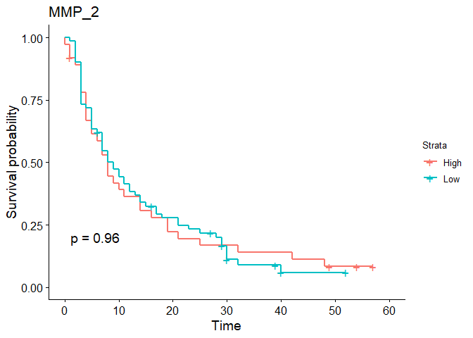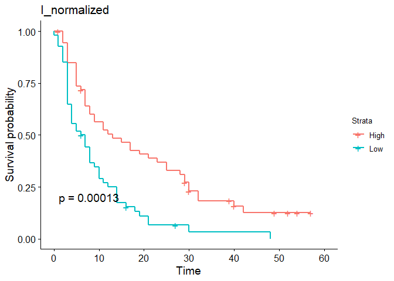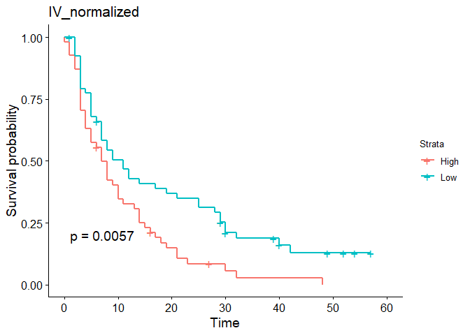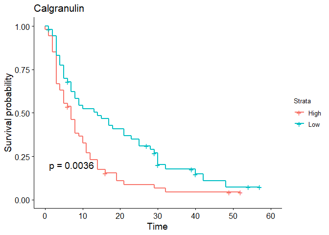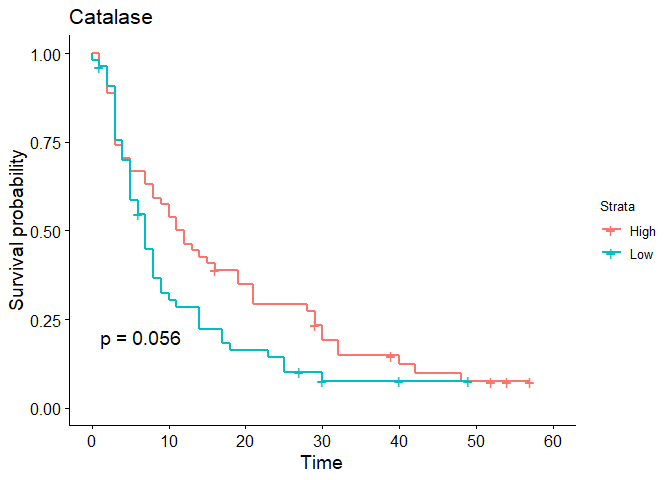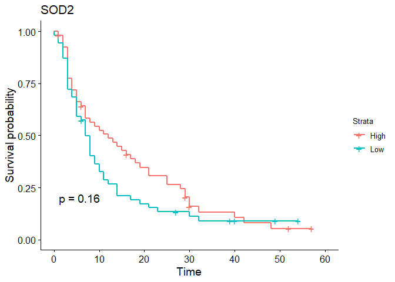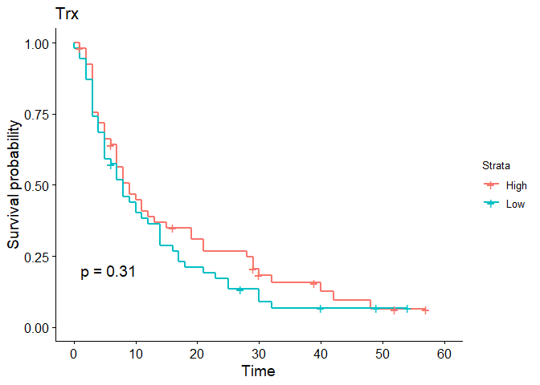

</div>

In each plot we can see the p value of the Log Rank Test. We observe
that some of the biomarkers has very high significant: the Commet Assays
and Calgranulin. We still need keep in mind this is a Univariate
analysis, meaning this shows only the effect of one biomarker
individually, and doesn’t take into account other parameters.

</div>

###### Multi-Variate model - Cox Proportional Hazard model

Now we will perform Multivariate analysis which can tell us the effect
of each biomarker when considered together with the confounders (Gender,
Age, Therapy and Tumor type). We use a cox regression to build a model
.Usually in this model you use all the explanatory variables, but
because of the small size of the data set we will build a model for each
biomarker with the confounders rather than building univariate model for
all the biomarkers together.

``` r
Liver_cox<-Liver_data # we work on a copy
biomarkeres<-names(Liver_cox[5:15]) #save the names of the biomarkes
```

We check several models consisted of the confounders, the biomarker and
interactions between them. The ‘frailty’ function add a simple random
effects term in attempt to simulate different stages of the disease. The
‘step’ function select the best formula for the model.

``` r
res_cox<-purrr::map(biomarkeres,~step(coxph(as.formula(paste("Surv(Survival, event) ~ Gender + Age + (Therapy + frailty(Primary_Tumor))*", .x)),data= Liver_cox),trace = 0))
```

From every Cox model we are able to extract a linear predictor. This is
the size of the effect of the biomarker on survival calculated by the
model. We extract the vectors of the linear predictors and create a
table

``` r
risk_predictors_matrix<-0 #initiate the table
for(model in 1:length(res_cox)){
  risk_predictors_matrix<-cbind(risk_predictors_matrix,res_cox[[model]]$linear.predictors)
}
risk_predictors_matrix<-risk_predictors_matrix[,-1] #remove the initial variable.
head(risk_predictors_matrix)
```

    ##                                                                       
    ## [1,]  0.1438640  0.1438640  0.3277846 0.4021547  0.10748381  0.6139160
    ## [2,]  0.1438640  0.1438640  0.5200620 0.8641079  0.31292880  1.0314870
    ## [3,]  0.1438640  0.1438640  0.1997272 0.1667875  0.16047735 -0.1655018
    ## [4,]  0.1438640  0.1438640  0.3605302 0.4255038  0.04723967 -0.2118182
    ## [5,] -0.5623774 -0.5623774 -0.4960321 0.8163948 -0.70566084 -0.6693333
    ## [6,]  0.1438640  0.1438640  0.2271934 0.3302728  0.10732531 -0.2118182
    ##                                                              
    ## [1,]  0.1438640  0.37850245  0.4762330  0.48131841  0.1438640
    ## [2,]  0.1438640  0.39495682  0.4001837  0.46070666  0.1438640
    ## [3,]  0.1438640  0.16600522  0.2550987  0.44451172  0.1438640
    ## [4,]  0.1438640  0.35875125 -0.1009258  0.47007285  0.1438640
    ## [5,] -0.5623774 -0.53988622 -0.6855069 -0.87129884 -0.5623774
    ## [6,]  0.1438640  0.02938438  0.2369201 -0.03107927  0.1438640

``` r
dim(risk_predictors_matrix)
```

    ## [1] 108  11

The tables size is 108 (observation) X 11 (biomarkers). Every cell
contains a linear predictor of every biomarker for each observation.

</div>

#### Consensus Matrix and Hierarchical Classification

So, now we have a table with the size of effect of every biomarker on
survival for every observation. If you look on one line, we actually
look on a patient, and we observe how much each of his measured
biomarkers affect the individual survival. This is amazing, It is a
predictive personalized approach. But we want to know something slightly
different. We are interested whether we can find subgroups in Liver
malignancies which follows a certain pattern. If we will find subgroups
by patterns, we will maybe be able to customize a more fitting treatment
to these subgroup of patients. To do this we will use a method called
“Consensus Matrix” to determine the best number of clusters
(subgroups) in the predictors table.It is done by repetition a lot of
times and choose the best result of number of clusters. In the method we
use a clustering algorithm called “Hierarchical Clustering” to divide
the observation to clusters. We set the maximum number of clusters to
check to 4.

``` r
risk_matrix_T<-t(risk_predictors_matrix) # transpose the table
set.seed(99) 
#Generate clusters with consensus hierarchial clustering
dc = sweep(risk_matrix_T,1, apply(risk_matrix_T,1,median,na.rm=T))
rcc = ConsensusClusterPlus(dc,maxK=4,reps=50,pItem=0.8,pFeature=1,clusterAlg="hc")
```

    ## end fraction

    ## clustered
    ## clustered
    ## clustered

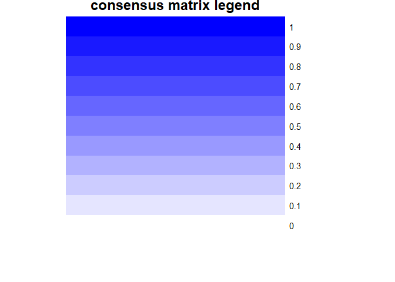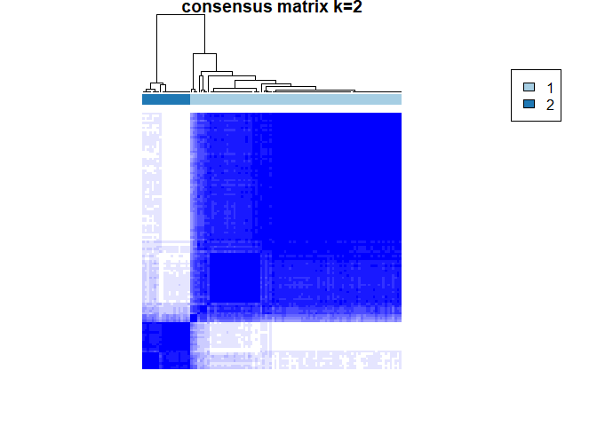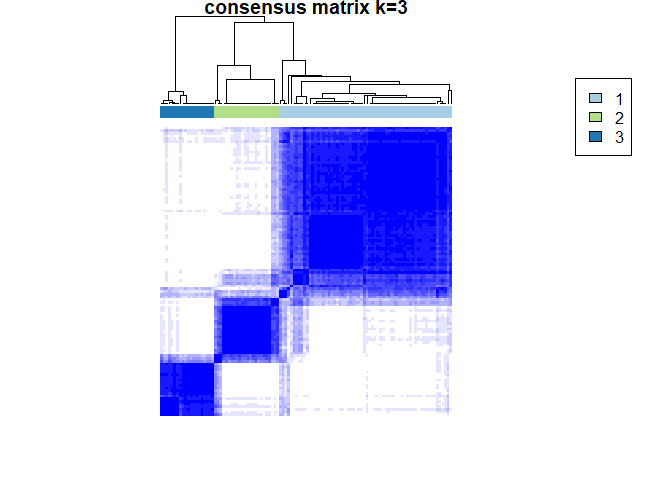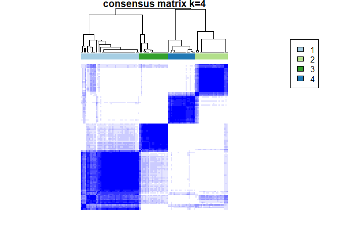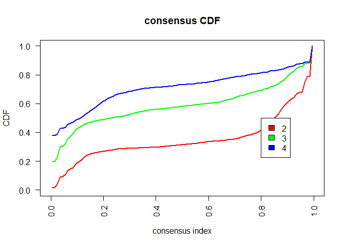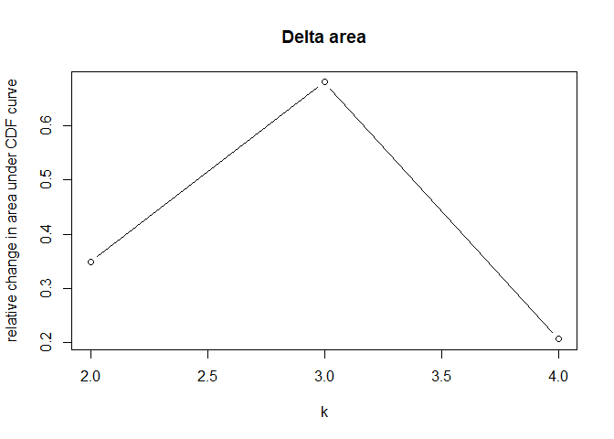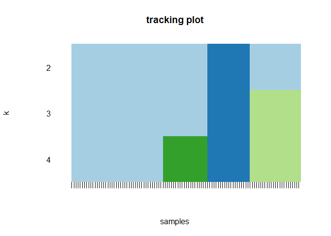

</div>

</div>

First, According to the Delta area graph we will choose 3 clusters. We
can observe the graphs with the blue rectangles, These are the
“consensus matrices”, every matrix to different number of clusters. We
can imagine that the X axis and Y axis are the observations from the
table, such that every observation on one axis is crossed with the rest
observation on the other axis. Full blue color means that an observation
on one axis always occurs together with fitting observation on the other
axis. On the other hand white color means those two observation never
occurs together in the same cluster. The best graph is one which has
full blue areas or full white areas. Above the blue rectangles we can
see the division into clusters. The consensus matrix for k=3 looks
pretty good.

We can see to what cluster every observation is classified into, and add
the labels to the data.

``` r
rcc[[3]][["consensusClass"]]
```

    ##   [1] 1 1 2 2 1 1 1 2 1 2 1 1 2 1 1 1 1 1 1 1 1 1 1 2 3 1 1 1 1 1 1 1 2 1 1
    ##  [36] 3 1 1 1 1 1 1 1 3 1 1 2 1 2 3 1 1 1 2 1 2 2 1 1 1 1 1 3 1 1 2 1 3 1 1
    ##  [71] 3 3 3 1 3 1 1 1 1 3 2 3 3 3 3 3 2 2 1 3 2 2 2 3 1 2 2 2 3 3 1 1 2 1 1
    ## [106] 1 1 2

``` r
Liver_cox$cluster<-as.factor(rcc[[3]][["consensusClass"]])
```

So we have classified every observation to a cluster, which we still
don’t know it’s characteristics. First we need to check if the
clusters are associated with one of the confounders. if so it means the
algorithm divided the observations into an already known pattern (one of
the confounders), which is not what we want.

``` r
chisq.test(Liver_cox$cluster, Liver_cox$Primary_Tumor)
```

    ## Warning in chisq.test(Liver_cox$cluster, Liver_cox$Primary_Tumor): Chi-
    ## squared approximation may be incorrect

    ## 
    ##  Pearson's Chi-squared test
    ## 
    ## data:  Liver_cox$cluster and Liver_cox$Primary_Tumor
    ## X-squared = 7.8657, df = 6, p-value = 0.2481

``` r
chisq.test(Liver_cox$cluster, Liver_cox$Gender)
```

    ## 
    ##  Pearson's Chi-squared test
    ## 
    ## data:  Liver_cox$cluster and Liver_cox$Gender
    ## X-squared = 1.2343, df = 2, p-value = 0.5395

``` r
chisq.test(Liver_cox$cluster, Liver_cox$Therapy)
```

    ## Warning in chisq.test(Liver_cox$cluster, Liver_cox$Therapy): Chi-squared
    ## approximation may be incorrect

    ## 
    ##  Pearson's Chi-squared test
    ## 
    ## data:  Liver_cox$cluster and Liver_cox$Therapy
    ## X-squared = 3.3764, df = 2, p-value = 0.1848

``` r
res.anova<-aov(Age ~ cluster, data = Liver_cox)
summary(res.anova)
```

    ##              Df Sum Sq Mean Sq F value Pr(>F)
    ## cluster       2     46    22.8   0.181  0.835
    ## Residuals   105  13226   126.0

None of the p-values are significant, is means there are no difference
for this variable, and that there is no association, which is good.

Now lets look on the survival between our 3 cluster and see if there is
a difference. We draw a Kaplan Meier plot

``` r
surv_object<-Surv(time = Liver_cox$Survival
                  ,event = Liver_cox$event)
fit1 <- survfit(surv_object ~ cluster, data = Liver_cox)
ggsurvplot(fit1, data = Liver_cox, pval = TRUE,
           legend = "right",legend.labs = c("1","2","3"), title="ALL PATIENTS")
```

<!-- -->
Seems like there is a difference in the survival between the groups.
Group number 3 has the best survival. Groups 1 and 2 have similar
survival but we need to see if there is a difference in their patterns,
because it is possible to have more than one pattern leading to the same
outcome.

</div>

#### Understanding the patterns

So we have 3 groups which apparently differ in their patterns. We will
use ggplot to draw box plots to see the differences between the groups

``` r
normalize <- function(x) { #normalization function
  return ((x - min(x)) / (max(x) - min(x)))
}

df<-Liver_cox #make a copy
for (i in 5:15) { # normalize all the biomarkers
  df[i] <- normalize(df[i])
}
my_comparisons <- list( c("1", "2"),c("1", "3"),c("2", "3")) # wanted comparisons
df.m <- melt(df[c(19,5:15)], id.var = "cluster")
ggplot(data = df.m, aes(x=cluster, y=value)) + 
  geom_boxplot() +
  facet_wrap(~variable,ncol = 4) +
  stat_compare_means(comparisons = my_comparisons) +
  theme(panel.spacing = unit(0.2, "lines"))
```

<!-- -->
Every plot is for one biomarker, and every box in a plot is one of the
groups. Recall the significant biomarkers we saw in the Kaplan Meier
plots: Commet Assays (CA)\_I ,CA\_III, CA\_IV and Calgranulin A. For
group 3 which has the best survival we observe that CA I, which points
out on undamaged DNA, is high, and on the other hand CA III and CA IV
which points out on damaged DNA, are low. It makes sense this group has
good outcome together with undamaged DNA. Additionally high Calgranulin
is observed in group 1, Calgranulin is already known as prognostic, as
higher it is as lower the survival. This information can be further
interpreted by physicians.

</div>

###### PREDICTION STRENGTH FOR CLUSTERING

The last issue is to see if the model we used can be generalized, and
maybe have an idea of how good it will perform on future data with the
same characteristics. To do so we will do cross validation. We repeat
the process a lot of times, and evaluate the result every time so we
will have a large sample of repetitions. after that we will evaluate
random classification and evaluate it, and compare our clustering model
(‘True value’) with the random classification. The evaluation is done
according to the paper “Cluster Validation by Prediction Strength” by R.
TIBSHIRANI and G. WALTHER. We will skip the code and see the results

``` r
# function to build the cox models and the predictors matrix
risk_model<-function(train, test = NULL){ 
  res_cox<-purrr::map(biomarkeres,~step(coxph(as.formula(paste("Surv(Survival, event) ~ Gender + Age + (Therapy + Primary_Tumor)*", .x)),data= train), trace = 0))
risk_predictors_matrix<-0
test_matrix<-0
for(model in 1:length(res_cox)){
  risk_predictors_matrix<-cbind(risk_predictors_matrix,res_cox[[model]]$linear.predictors)
  if(!missing(test)){test_matrix<-cbind(test_matrix,predict(res_cox[[model]],test,type = "lp"))}
}
  if(!missing(test)){
return(list("train" = as.data.frame(risk_predictors_matrix[,-1]), "test" = as.data.frame(test_matrix[,-1])))}
return(list("train" = as.data.frame(risk_predictors_matrix[,-1])))
}

#Initiate a vector for prediction scored of 'true' value
ps_score<-0
ps_Score_random<-0

hc_data<-Liver_cox
#outer loop. number of desired repeats/2 (the 2-folds inside the loop doubles it again)
for (i in 1:5) {
  #Random sampling the cluster labels generated from clustering all the data
  partitions<-sample(rownames(hc_data))
  # split to train and test
  train<-c(partitions[1:54])
  test<-c(partitions[55:108])
  # 2-fold loop. The if condition exchange the test and train every loop
  for (i in 1:2) {
    if(i==1){
      hc_train_samples<-hc_data[train,]
      hc_test_samples<-hc_data[test,]
    } else {
      hc_train_samples<-hc_data[test,]
      hc_test_samples<-hc_data[train,]
    }
    # the function builds a model and returns a matrix of fitted linear predictors of the train set,
    # and also returns a matrix of linear predictors predicted for the test set.
    res.pred<-risk_model(hc_train_samples,hc_test_samples)
    train_matrix<-res.pred$train # save the train and test matrixes
    c1_test_matrix<-res.pred$test
    fitted_test<-risk_model(hc_test_samples) # save copy 2 of the test matrix
    c2_test_matrix<-fitted_test$train
    
    # Hierarchial Clustering on train set
    matrix_T<-t(train_matrix)
    dc = sweep(matrix_T,1, apply(matrix_T,1,median,na.rm=T))
    rcc = ConsensusClusterPlus(dc,maxK=3,reps=10,pItem=0.8,pFeature=1,clusterAlg="hc",plot = FALSE)
    train_matrix$cluster<-as.factor(rcc[[3]][["consensusClass"]]) #add the labels for each observation to the train matrix
    
    # Hierarchial clustering for copy 1 of test set
    matrix_T<-t(c1_test_matrix)
    dc = sweep(matrix_T,1, apply(matrix_T,1,median,na.rm=T))
    rcc = ConsensusClusterPlus(dc,maxK=3,reps=10,pItem=0.8,pFeature=1,clusterAlg="hc",plot = FALSE)
    c1_test_matrix$cluster<-as.factor(rcc[[3]][["consensusClass"]]) #add the labels for each observation to the train matrix

    
    # Apply Logistic Regression Classifier
    # first the function needs manually defined a refference. I choose cluster 1
    train_matrix$cluster<-relevel(train_matrix$cluster, ref = 1)
    # fit the logistic regression
    multlogreg_fit <- multinom(cluster ~ V1 +V2 + V3 + V4 + V5 +V6 +V7+V8
                                +V9 +V10 +V11 , data = train_matrix,
                               trace = 0)
      
    # classify the copy 2 with the logistic regresiion model
    c2_test_matrix$cluster_predicted<-predict(multlogreg_fit,newdata = c2_test_matrix,"class")
    
    # check prediction strength and save the score
    ps_score<-rbind(ps_score,ps.cluster(c1_test_matrix$cluster,c2_test_matrix$cluster_predicted)[[1]])
    # Random Permutation option 1: Create random permutation of the classified test set lables, and check PS.
    ps_Score_random<-rbind(ps_Score_random,ps.cluster(c1_test_matrix$cluster,sample(c2_test_matrix$cluster_predicted))[[1]])
    }
}
```

<!-- -->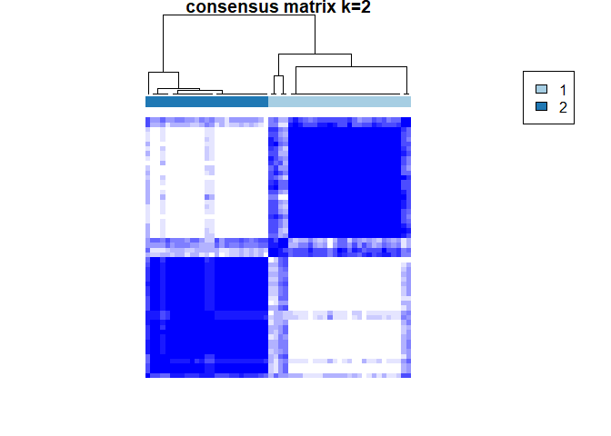<!-- -->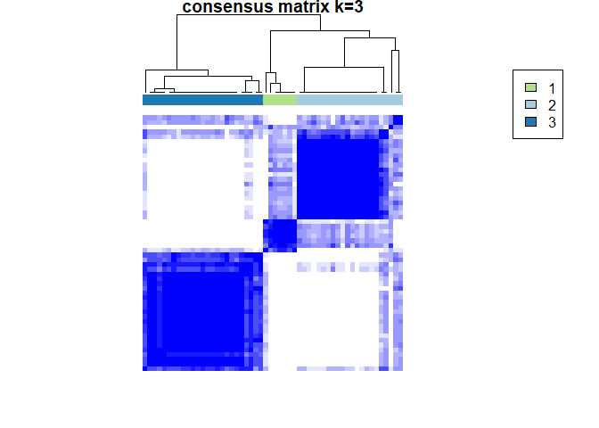<!-- -->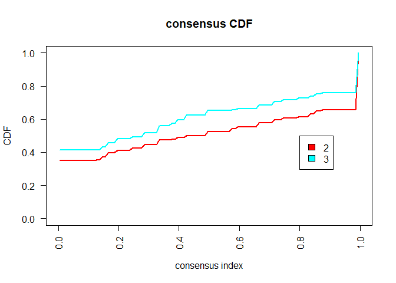<!-- -->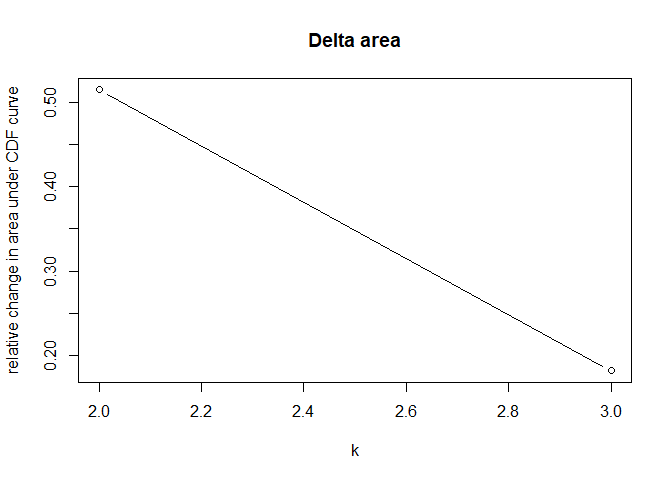<!-- -->
Compare the scores of the random classification and the ‘true value’

``` r
# prepare the data
ps_score<-as.data.frame(ps_score)
ps_score$type<-as.factor("True")
ps_Score_random<-as.data.frame(ps_Score_random)
ps_Score_random$type<-as.factor("Random")

ps_score_combined<-rbind(ps_score[-1,],ps_Score_random[-1,]) # drop the first score from every vector because it was the initiation with score 0
ggplot(ps_score_combined, aes(x=type, y=V1,fill=type)) + 
  geom_violin() +
  geom_boxplot(width=0.1) +
  stat_summary(fun.y=mean, geom="point", shape=20, size=4,color = "blue")+
  labs(title = "Prediction Strength scores")+
  theme(plot.title = element_text(hjust = 0.5))
```

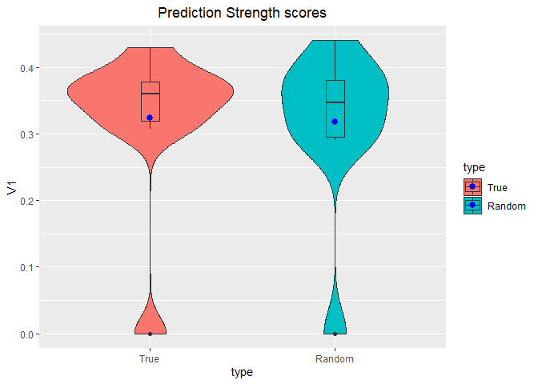<!-- -->
We can check the average score of the random and true values

``` r
sum(ps_score[,1])/(length(ps_score[,1])-1)
```

    ## [1] 0.3235563

``` r
sum(ps_Score_random[,1])/(length(ps_Score_random[,1])-1)
```

    ## [1] 0.3175379

Finally we compare them with a statistical test

``` r
#check normal distribution and run wilcoxon/t tests accordingly
shapiro.test(ps_score[-1,1])
```

    ## 
    ##  Shapiro-Wilk normality test
    ## 
    ## data:  ps_score[-1, 1]
    ## W = 0.6591, p-value = 0.0002824

``` r
shapiro.test(ps_Score_random[-1,1])
```

    ## 
    ##  Shapiro-Wilk normality test
    ## 
    ## data:  ps_Score_random[-1, 1]
    ## W = 0.75115, p-value = 0.003685

``` r
wilcox.test(ps_score[-1,1],ps_Score_random[-1,1],paired = TRUE)
```

    ## Warning in wilcox.test.default(ps_score[-1, 1], ps_Score_random[-1, 1], :
    ## cannot compute exact p-value with zeroes

    ## 
    ##  Wilcoxon signed rank test with continuity correction
    ## 
    ## data:  ps_score[-1, 1] and ps_Score_random[-1, 1]
    ## V = 23, p-value = 1
    ## alternative hypothesis: true location shift is not equal to 0

</div>

To summarize, on one hand the Wilcoxon test shows there is a significant
difference between random classification and out trained model, which
means that the trained model has better performance. But on the other
hand the plots are very simillar beside the fact the ‘true’ score is
slightly higher. The same distribution worries a bit, maybe it points on
simillar perfomance to a random classification. Anycase, this workflow
should be validated with larger sample of patients if we want to apply
it in the future in healthcare world.
